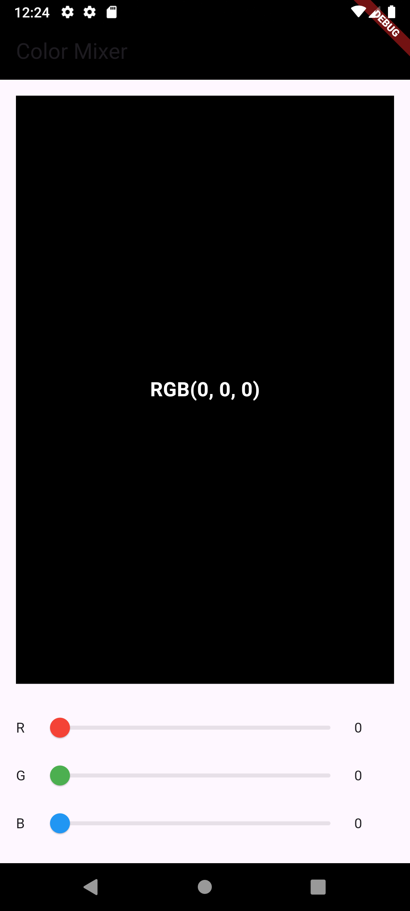

# color_mixer

A simple and interactive Flutter application that allows you to create custom colors by mixing Red, Green, and Blue values using sliders.



## 🚀 Features

-   **Interactive Color Sliders**: Three distinct sliders to control the Red, Green, and Blue (RGB) color channels.
-   **Real-time Preview**: A large container instantly updates to display the color you are creating.
-   **Dynamic UI**: The `AppBar`'s background color also changes in real-time to match your selection.
-   **Live Value Display**: See the exact RGB values (0-255) as you move the sliders.
-   **Smart Text Contrast**: The text displaying the RGB values automatically switches between black and white to ensure it's always readable against the current background color.

## Getting Started

This project is a starting point for a Flutter application. To get a local copy up and running, follow these simple steps.

### Prerequisites

You need to have the Flutter SDK installed on your machine. You can find instructions here:
Flutter - Get Started

### Installation & Running

1.  Navigate to the project directory
    ```sh
    cd color_mixer
    ```
2.  Install dependencies
    ```sh
    flutter pub get
    ```
3.  Run the app
    ```sh
    flutter run
    ```

A few resources to get you started if this is your first Flutter project:

- Lab: Write your first Flutter app
- Cookbook: Useful Flutter samples

For help getting started with Flutter development, view the
online documentation, which offers tutorials,
samples, guidance on mobile development, and a full API reference.

